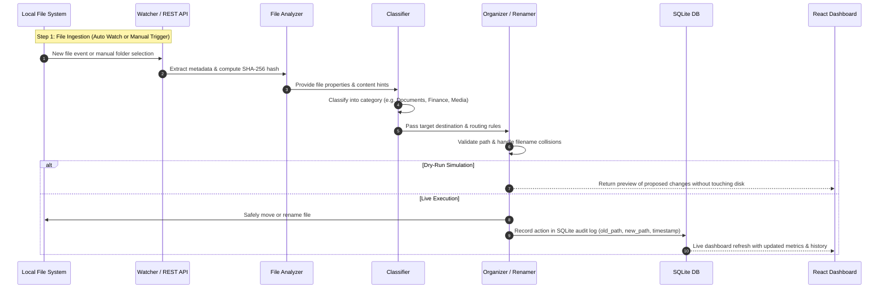

# FileFlow-AI
AI-powered privacy-first desktop assistant that intelligentlyclassifies, renames, organizes, and manages local files in real time.
🚀 FileFlow AI

An AI-powered, privacy-first local file organization assistant

FileFlow AI is a desktop productivity application designed to
automatically understand, classify, rename, and organize files on a
user's computer.

🏆 Hackathon

HackDevengers 2.0 --- 2026

FileFlow AI is being developed as an original open-innovation project
for the hackathon.

💡 Problem

Users accumulate downloaded documents, resumes, certificates, invoices,
notes, images, archives, and duplicate files. Generic filenames and
manual folder management make local storage difficult to maintain.

💡 Solution

FileFlow AI monitors selected local folders, analyzes incoming files,
classifies them, suggests meaningful names and categories, creates
folders when needed, moves files, detects duplicates, and records
actions so users can review or undo supported operations.

New File
   ↓
File Watcher
   ↓
Metadata / Content Analysis
   ↓
AI Classification
   ↓
Smart Filename
   ↓
Safety Check
   ↓
Move / Rename
   ↓
Activity Log
   ↓
Dashboard / Undo

✨ Key Features

📡 Real-time file monitoring

🧠 Content-aware AI classification

✏️ Smart file renaming

📁 Automatic folder creation

🔍 Duplicate detection

↩️ Activity history and undo

📊 Dashboard for organized files and recent actions

## 🏗️ System Architecture

FileFlow AI is built on a multi-tiered, event-driven, local-first architecture designed for speed, user privacy, and predictable file operations.

```mermaid
graph TD
    subgraph UI ["🖥️ Presentation Layer (React 18 + Vite)"]
        DASH["📊 Dashboard<br/>(Metrics, Activity, Storage)"]
        FILES["📁 Files Browser<br/>(Categorized Views & Preview)"]
        ORG["⚡ Organize View<br/>(Dry-run & Live Movement)"]
        REN["✏️ Smart Renamer<br/>(Batch Patterns & Sanitization)"]
        DUP["🔍 Duplicate Finder<br/>(Hash Groups & Cleanup)"]
        SET["⚙️ Settings<br/>(Monitored Paths & Rules)"]
    end

    subgraph API ["⚡ API & Orchestration Layer (FastAPI)"]
        ROUTER["REST API Endpoints<br/>(/api/analyze, /classify, /organize,<br/>/rename, /duplicates, /stats, /files)"]
        BG["Background Task Daemon<br/>(Watchdog Thread Runner)"]
    end

    subgraph CORE ["🧠 Core Processing Engine (Python)"]
        WATCH["📡 File Watcher<br/>(watchdog.observers.Observer)"]
        ANA["🔬 File Analyzer<br/>(MIME, Timestamps, Size, SHA-256)"]
        CLASS["🏷️ File Classifier<br/>(Rule-based & Content Heuristics)"]
        ORGENG["📦 Organization Engine<br/>(Path Routing, Collision Resolution, Dry-Run)"]
        RENENG["✍️ Renaming Engine<br/>(Regex Patterns, Sanitization, Counters)"]
        DUPENG["🔎 Duplicate Detector<br/>(Fast Size Filter + SHA-256 Hashing)"]
    end

    subgraph STORAGE ["💾 Storage & Audit Layer"]
        DB[("🗄️ SQLite Database (fileflow.db)<br/>• files<br/>• actions<br/>• file_actions")]
        FS["📂 Local File System<br/>(Monitored Sources & Target Categories)"]
    end

    UI <-->|HTTP / JSON (Axios)| ROUTER
    ROUTER --> BG
    BG --> WATCH
    WATCH --> ANA
    ROUTER --> ANA
    ROUTER --> CLASS
    ROUTER --> ORGENG
    ROUTER --> RENENG
    ROUTER --> DUPENG
    ANA --> CLASS
    CLASS --> ORGENG
    ORGENG --> FS
    ORGENG --> DB
    RENENG --> FS
    RENENG --> DB
    DUPENG --> FS
    DUPENG --> DB
    ROUTER <--> DB
```

### Architectural Layers

1. **Presentation Layer (`frontend/`)**:
   - Modern single-page application built with **React 18** and bundled with **Vite**.
   - Modular views for live file statistics, batch file organization with dry-run support, batch renaming, duplicate detection, and watcher settings.
   - Communicates with the backend using RESTful JSON APIs via Axios.

2. **API & Orchestration Layer (`backend/api.py`)**:
   - High-performance asynchronous REST API built with **FastAPI** and **Uvicorn**.
   - Handles background task execution for the asynchronous file watcher.
   - Provides dry-run simulation mode for previewing organization actions before modifying the disk.

3. **Core Processing Engine (`backend/`)**:
   - **File Watcher (`watcher.py`)**: Real-time operating system file-event listener built on `watchdog`.
   - **File Analyzer (`analyzer.py`)**: Gathers file metadata (size, MIME type, timestamps, cryptographic SHA-256 hash).
   - **Classifier (`classifier.py`)**: Smart heuristic and rule-based categorization into 9 distinct domains (Documents, Code, Media, Archives, Data, etc.).
   - **Organization Engine (`organizer.py`)**: Manages safe directory creation, conflict avoidance (auto-incrementing file suffixes), and safe filesystem movement.
   - **Renamer (`renamer.py`)**: Configurable pattern matcher supporting prefix/suffix rules, date stamping, lowercase normalization, and character sanitization.
   - **Duplicate Detector (`duplicate.py`)**: Efficient two-pass duplicate detection combining preliminary file-size grouping with precise SHA-256 content verification.

4. **Storage & Audit Layer (`backend/database.py`)**:
   - Embedded **SQLite** database (`fileflow.db`) ensuring all file discoveries, renames, and moves are immutably logged with rollback and audit capabilities.

### 🔄 End-to-End Data Flow Pipeline




🛠️ Technology Stack

Backend / Desktop Engine

Python

Watchdog

pathlib / OS APIs

shutil

hashlib

PyMuPDF

SQLite

AI

The AI layer will be used for semantic classification, document
understanding, and smart filename generation. The exact model/provider
will be selected during implementation based on reliability and
hackathon constraints.

Frontend

React

Vite

CSS / Tailwind CSS

API

FastAPI

🔐 Privacy & Safety

FileFlow AI follows a local-first design:

No automatic file deletion in the MVP.

User-selected folders only.

Operations are logged.

Supported operations can be undone.

Local processing is preferred where practical.

External AI services receive only the minimum information required
when they are used.

System-critical directories should not be monitored.


🚀 MVP Roadmap

Phase 1 --- Core Automation

Project setup

Folder monitoring

New-file detection

File categorization

Automatic folder creation

Safe file movement

Phase 2 --- AI

PDF text extraction

AI classification

Smart filename generation

Confidence / reasoning information

Phase 3 --- Safety

Duplicate detection

Activity history

Undo

Filename conflict handling

Error handling

Phase 4 --- Dashboard

React dashboard

Statistics

Recent activity

Action details

Manual review controls

🎯 Example

Before

Downloads/
├── download123.pdf
├── bill9382.pdf
├── resume_final2.pdf
├── IMG_8273.jpg
└── notes.zip

After

FileFlow/
├── Career/
│   └── Nitesh_Resume_2026.pdf
├── Finance/
│   └── Electricity_Bill_Sep_2026.pdf
├── Images/
│   └── IMG_8273.jpg
└── Archives/
    └── Notes.zip

🧪 Demo Scenario

Select a Downloads folder.

Add several sample files.

FileFlow detects the new files.

Files are analyzed and classified.

Meaningful names and destinations are suggested.

Files are organized.

The dashboard shows the activity.

A supported operation is reversed using Undo.

🌱 Future Scope

Semantic local file search

OCR for scanned documents

Natural-language organization rules

Version tracking

Similar-file detection

On-device AI models

Document expiry detection

Personal document profiles

Natural-language commands

⚠️ Safety

File-system automation must be reversible and predictable. The MVP will
avoid automatic deletion, validate paths, handle filename conflicts, log
operations, and restrict monitoring to user-selected directories.

👨‍💻 Author

Nitesh Kumar Barnwal
B.Tech --- Computer Science & Engineering
Narula Institute of Technology

## 🚀 Current Status

### ✅ Completed Features

**Phase 1 - Core Automation (COMPLETED)**
- ✅ Project setup and structure
- ✅ Folder monitoring with Watchdog
- ✅ New-file detection
- ✅ File categorization (9 categories)
- ✅ Automatic folder creation
- ✅ Safe file movement with dry-run mode

**Phase 2 - AI (PARTIALLY COMPLETED)**
- ✅ Rule-based classification system
- ✅ File metadata analysis
- ⏳ PDF text extraction (PyMuPDF ready)
- ⏳ AI-powered classification (API ready)
- ⏳ Smart filename generation (renamer module ready)

**Phase 3 - Safety (COMPLETED)**
- ✅ Duplicate detection with hash comparison
- ✅ Activity history with SQLite database
- ✅ Action logging and tracking
- ✅ Filename conflict handling
- ✅ Error handling throughout
- ⏳ Undo functionality (database structure ready)

**Phase 4 - Dashboard (COMPLETED)**
- ✅ React frontend with Vite
- ✅ FastAPI backend server
- ✅ Statistics dashboard
- ✅ Recent activity display
- ✅ File browser
- ⏳ Manual review controls
- ⏳ Action details and undo UI

### 🛠️ Technology Stack Implementation

**Backend (COMPLETED)**
- ✅ Python 3.x
- ✅ Watchdog for file monitoring
- ✅ pathlib for file operations
- ✅ shutil for file movement
- ✅ hashlib for duplicate detection
- ✅ SQLite for activity logging
- ✅ FastAPI for REST API
- ✅ PyMuPDF (ready for PDF extraction)

**Frontend (COMPLETED)**
- ✅ React 18
- ✅ Vite for build tooling
- ✅ CSS for styling
- ⏳ Tailwind CSS (can be added)
- ✅ Axios for API calls

### 📁 Project Structure

```text
FileFlow-AI/
├── backend/                        # Python backend application & core processing engines
│   ├── _init_.py                   # Package initializer
│   ├── main.py                     # Unified CLI tool for analysis, organization & folder watching
│   ├── api.py                      # FastAPI REST API server, routers & background task manager
│   ├── analyzer.py                 # File metadata extraction, MIME type detection & SHA-256 hashing
│   ├── classifier.py               # Heuristic & rule-based file classification (9 distinct categories)
│   ├── organizer.py                # Safe file routing, directory auto-creation & collision resolution
│   ├── renamer.py                  # Batch file renaming with regex pattern matching & sanitization
│   ├── duplicate.py                # Two-tier duplicate detection (file size filtering + hash verification)
│   ├── database.py                 # SQLite database manager for tracking files & audit history
│   ├── watcher.py                  # Watchdog-based real-time folder monitoring daemon
│   ├── test_pipeline.py            # Automated test pipeline for analyzer & categorization
│   └── test_rename.py              # Test suite verifying batch renaming logic
├── frontend/                       # React 18 + Vite dashboard interface
│   ├── src/
│   │   ├── components/
│   │   │   ├── Dashboard.jsx       # Overview metrics, storage status & recent activity feed
│   │   │   ├── Dashboard.css       # Styling for dashboard cards & metrics
│   │   │   ├── Files.jsx           # Categorized file explorer & metadata inspection
│   │   │   ├── Files.css           # Styling for file list and detail views
│   │   │   ├── Organize.jsx        # Interactive folder organization with dry-run toggle
│   │   │   ├── Organize.css        # Styling for organization workflows & results
│   │   │   ├── Rename.jsx          # Batch renamer tool with prefix, suffix & pattern preview
│   │   │   ├── Rename.css          # Styling for rename preview & form
│   │   │   ├── Duplicates.jsx      # Duplicate file group detector & disk cleanup tool
│   │   │   ├── Duplicates.css      # Styling for duplicate groups & comparison
│   │   │   ├── settings.jsx        # Configuration for monitored folders & preferences
│   │   │   ├── settings.css        # Styling for settings page
│   │   │   ├── Sidebar.jsx         # Navigation sidebar for tab switching
│   │   │   └── Sidebar.css         # Styling for sidebar navigation
│   │   ├── App.jsx                 # Root component with routing/tab state & layout
│   │   ├── App.css                 # Application-level layout styling
│   │   ├── main.jsx                # React DOM entry point
│   │   └── index.css               # Global typography, CSS variables & base styles
│   ├── index.html                  # HTML entry point for Vite
│   ├── package.json                # Frontend dependencies & npm scripts
│   ├── package-lock.json           # Locked npm dependency tree
│   ├── vite.config.js              # Vite bundler configuration & dev server proxy
│   └── .gitignore                  # Frontend ignore patterns
├── sample_files/                   # Test fixtures & simulated directory sandbox
│   ├── incoming/                   # Incoming directory for file watcher testing
│   ├── organized/                  # Target output folder categorized by type
│   ├── organized_test/             # Automated test target directory
│   ├── duplicate_notes.txt         # Duplicate test fixture for notes
│   ├── duplicate_resume.txt        # Duplicate test fixture for resume
│   ├── test_certificate.txt       # Sample document for certificate classification
│   ├── test_invoice.txt           # Sample document for finance/invoice classification
│   ├── test_notes.txt             # Sample notes document
│   ├── test_report.txt            # Sample report document
│   ├── test_resume.txt            # Sample resume document
│   └── ...                         # Other rename and watcher test fixtures
├── test_api_organize.py            # API test script verifying dry-run organize endpoint
├── test_api_organize_wet.py        # API test script verifying live organize execution
├── test_api_rename.py              # API test script verifying batch renaming endpoint
├── test_organize.json              # Sample JSON payload for organize API
├── fileflow.db                     # SQLite database file storing file index & audit trail
├── requirements.txt                # Python backend dependencies (FastAPI, Watchdog, etc.)
└── README.md                       # Comprehensive project documentation
```

### 🧩 Module Breakdown & Responsibilities

| Component / Module | Path | Primary Responsibility |
| :--- | :--- | :--- |
| **FastAPI Server** | `backend/api.py` | Exposes REST endpoints, validates inputs, and manages background tasks |
| **CLI Interface** | `backend/main.py` | Command-line tool to analyze, organize, rename, and watch folders |
| **File Watcher** | `backend/watcher.py` | Uses `watchdog` to monitor filesystem events and auto-trigger pipelines |
| **File Analyzer** | `backend/analyzer.py` | Extracts file size, timestamps, MIME types, and SHA-256 cryptographic hashes |
| **Classifier** | `backend/classifier.py` | Heuristic engine sorting files into 9 categories (Documents, Code, Media, etc.) |
| **Organizer** | `backend/organizer.py` | Handles directory structure creation, safe file moving, and collision avoidance |
| **Renamer** | `backend/renamer.py` | Batch renaming with pattern replacements, date stamps, and sanitization |
| **Duplicate Detector**| `backend/duplicate.py` | Groups duplicates by file size and verifies identical SHA-256 signatures |
| **Database Manager** | `backend/database.py` | Manages SQLite connection, table schemas, action audit logging, and queries |
| **Dashboard UI** | `frontend/src/components/Dashboard.jsx` | Overview statistics, category distribution, and recent activity log |
| **File Explorer UI** | `frontend/src/components/Files.jsx` | Browse files by category with detailed metadata inspection |
| **Organize UI** | `frontend/src/components/Organize.jsx` | Source/destination folder selection with dry-run preview and batch organize |
| **Rename UI** | `frontend/src/components/Rename.jsx` | Pattern configuration, live preview, and batch renaming |
| **Duplicates UI** | `frontend/src/components/Duplicates.jsx` | Duplicate detection scan, grouped view, and disk space reclaim |
| **Settings UI** | `frontend/src/components/settings.jsx` | Configure monitored folders, watch intervals, and auto-organize options |

### 🚀 Quick Start

**Backend (CLI):**
```bash
# Install dependencies
pip install -r requirements.txt

# Analyze a file
python backend/main.py analyze sample_files/test.txt

# Organize files
python backend/main.py organize ./downloads ./organized --dry-run

# Watch a folder
python backend/main.py watch ./sample_files

# Show statistics
python backend/main.py stats
```

**Backend (API):**
```bash
# Start FastAPI server
python backend/api.py

# API will be available at http://localhost:8000
# API docs at http://localhost:8000/docs
```

**Frontend:**
```bash
cd frontend
npm install
npm run dev

# Dashboard will be available at http://localhost:3000
```

### 🎯 Demo Status

The application is fully functional with:
- ✅ Working CLI interface
- ✅ REST API server
- ✅ React dashboard
- ✅ Real-time file monitoring
- ✅ File classification and organization
- ✅ Duplicate detection
- ✅ Activity logging
- ✅ Safe file renaming

Ready for hackathon demonstration!